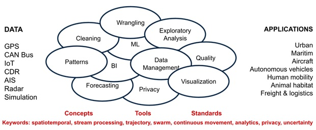
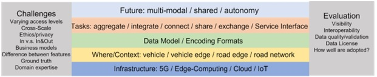
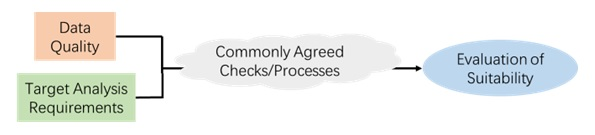
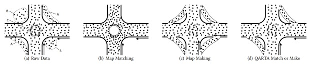
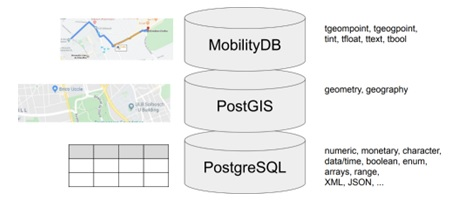
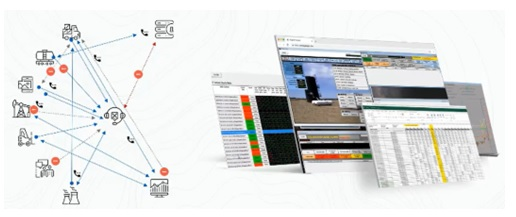
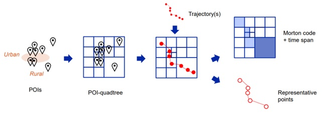
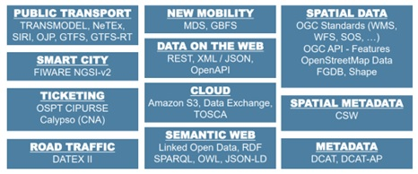
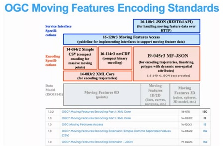
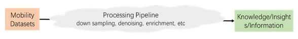

[obligation=informative]
== Overview
Almost every activity in our modern life leaves a digital trace, typically including location and time. Either captured by a sensor, manually input, or extracted from a social media post, the increase in the volume, variety, and velocity of spatiotemporal data nowadays is unprecedented. The ability to manage and analyze this data is important for many application domains, including smart cities, health, transportation, agriculture, sports, biodiversity, etc. Since the civilian use of GPS was allowed in 1980, followed by the technological advances in other location tracking systems – wifi, RFID, bluetooth, etc, it is becoming more and more easy to track moving objects. The Mobility Data Science Summit will discuss the challenges of managing this data and making sense of it, with a focus on the tooling and standardization requirements.

]

Data science is commonly known as the pipeline of methods and tools from data acquisitions, until the delivery of useful insights, going through data cleaning, integration, management, and analysis. Many tools exist for helping data scientists in every step in this pipeline. Yet mobility data has its own characteristics that cannot be handled by the common data science tools. Mobility data is typically available in the form of sequences of location points with time stamps, that are generated by location tracking devices. So it is both multidimensional and time series data, a structure that requires special data science tools and methods.

OGC has proactively envisioned the need for specialized data models and exchange formats, and formed work groups including moving features SWG and Temporal DWG. It is also natural that the temporal concepts found their way to the work of other work groups, such as GeoPose. This summit aimed to synchronize across work groups, and to align the concepts.

=== What is special about ‘Mobility’ when it comes to Data Science?

Nowadays, it is not surprising that mobility data can find important applications in a broad range of domains such as maritime, public transport, and logistics. In some sense, it can have a fundamental impact in many aspects of real-life.

Different from other types of data like spatial data and time series data, mobility data has several challenging characteristics. (1) **Dynamic: **mobility data records the evolving/changing history of some movement features over time. One characteristic of mobility data is that it is not updated once collected and stored, i.e., append-only. However, most existing data infrastructures and formats were designed for static attributes, making them inapplicable for handling dynamic data, e.g., dynamic metadata in the map, which may require clever use of attributes in OpenStreetMap. (2) **Diverse**: because mobility data can be collected using various devices (e.g., GPS, Bluetooth, RFID) and sampling strategies, availability of mobility data and scale/frequency of collection varies a lot across different datasets. So analysis methods and tools may not be transportable across multiple types of data. Also, precision in mobility data can vary, so people need to consider scale and precision with respect to the science being explored e.g., movement of people, wildlife tracking, agriculture, etc. (3) **Heterogeneous**: besides the common form of mobility data as a sequence of time-stamped points, some discrete check-in data (e.g., geo-tagged tweet posts, ticketing/accounting data, and taxi pick-up/drop-off data) can also be treated as mobility data when they are linked to an individual or cluster of individuals over time. For example, some public transport companies in Brussels are interested in developing a common ticketing scheme that can support multimodal transportation. However, such data usually do not have accurate coordinates/locations attached, making their analysis and modeling more complex. For example, interpolation on such data may not make sense at all, and the lack of continuous tracking of moving objects makes it hard or even impossible to do some aggregation analysis, such as centroid of movement, average of some scalar properties like speed, etc. Currently, there is not much analysis done on such data, and it is envisioned that different analysis methods are needed to mine the value of mobility hidden in such
data.

As shown in Fig. 1, mobility data science brings requirements to several layers, from the low level of computation infrastructure to the high
level of data modeling and various tasks.

**Computation** **Infrastructure **determines where and how mobility data can be generated, collated, derived, swapped and archived.** (1)** **Cloud Services **are widely deployed in recent years due to many advantages like easy scalability and high availability**.** There are lots of cloud services in the market, not just the large providers like Azure and AWS. Many cloud platforms have their unique value for specialized use. However, most existing cloud services target general data, as a result, is it possible to build mobility data cloud using some basic modules provided by these available cloud services now? To support mobility data science, the power is actually&nbsp; in coupling and connecting these cloud services (linked and available data) and cloud connectivity is required, because probably no one cloud fits everything. However, it remains a challenge to connect different cloud services to work together, because the mobility data from multiple clouds may have different semantics and do not necessarily plan to work together, so just a big data lake is not enough. Another issue is that cloud providers may offer everything that we need, but not necessarily organized or assembled in a fashion that is immediately useful. Also, it is relatively easier to collect data than use/analyze data, so a lot of information can be found on the cloud now, much collected, but the question remains on how much is made accessible and usable? **(2) Edge Computing/IoT** Mobility data may go through several places from where it is generated to where it is used, e.g., **from vehicle to vehicle edge to road edge to road network to cloud**. Those places can differ a lot in terms of their computational power, and it is worthwhile to investigate which kinds of tasks are better put (assigned) at (to) which kinds of places, and what encoding formats are more suitable for those resource-constrained devices.** (3) 5G offers unprecedented ultra-low latency**, thus enabling the capturing of features that require very high sampling frequency, such as orientation, which is relatively new compared to typical features like longitude-latitude. Another implication of 5G is that it is not about having to do tasks at the edge side or the cloud side, but it allows seamlessly moving data/computations around between edge and cloud. So coupled with the mobility data characteristics, these computation infrastructure call for innovative data modeling techniques and encoding formats such that mobility data can flow through various computational contexts/environments smoothly.

Next, **mobility data tasks** face more challenges than other types of data. **(1)** **fusion of sensors (data aggregation/integration)**. Nowadays, moving objects are equipped with an array of sensors, and it is often the case that trajectories need to be built based on multiple sensor inputs. For example, cars are now full of sensors, so we have a "data ocean”. Such fusion of multiple inputs allows analysis of heterogeneous data of independent moving features, thus enabling interesting applications such as autonomous robot navigation. However, the following issues still need to be solved. (a) varying levels of access to data causes problems with aggregation, (b) different sources do not necessarily plan to work together, (c) friction on aggregation is very high due to different data models and semantics, (d) although there is lots of work on trajectories, aggregation of trajectory data may lead us to better-fitting use cases, (e) for time-critical situations where every second matters, such as fire rescue and disaster risk management, how to efficiently aggregate multiple sensor inputs and stitch all kinds of dynamic data in real-time to support timely decision making is still a challenging problem, and (f) how to align sources with different spatial and temporal resolution.** (2)** **data sharing.** Some communities have drivers to ensure data sharing: ocean science and arctic studies - just so hard to collect that they have to share. And some communities share voluntarily very well, such as cyclists. Although most people agree that mobility data sharing can lead to improvements in society, there is still reluctance to share. **Barriers include privacy, loss of competitive advantage, lack of cloud solutions, regulatory compliance, fear of losing control, interoperability issues, etc. **Moreover, business models can be one way - sharing into a system that is not shared back out**. (3) Visualization** is a good way for people to explore mobility data. However, when dealing with massive amounts of mobility data, just plotting everything makes a big mess. So a common practice is to use GIS software to visualize aggregated results. In such cases it becomes necessary to do data aggregation and produce **visual summaries** that make sense for moving data. For example, mobility data can be represented as density maps and grid-based description of values and trends through "prototypes", e.g., showing density of objects moving north in a grid. In the geography community, Discrete Global Grid Systems (DGGS) is shown to be valuable, and grids are super useful in doing grid-based analysis on scalable computing clusters; particularly equal-area grids. **(4)** **Mobility data science as a service**. It is desirable that mobility data science can be provided as a service, which can provide rich functionalities to help users better utilize and understand mobility data. Probably, typical statistics are not enough for this purpose, and users will be more interested to ask mobility questions, such as “Are there any times when two cars come close within 100 meters?”. So it needs to be investigated how to express such requests in an API, and the emerging OGC APIs and SQL may serve as a basis for such service interfaces.

In terms of general mobility data challenges, one special concern is **privacy issues**. Privacy can block analysis or can enable better analysis by using more restrictive data. This issue concerns not only humans, but also some commercial animals, although wildlife generally do not have this problem. For example, cows can be tracked to provide business-sensitive analyses. For humans, due to the highly predictable nature of human behaviors, even small pieces of mobility data can lead to the leakage of identity information. So it is important to find the balance between utility of data and privacy preservation. Unfortunately, most privacy preservation methods restrict analysis ability and de-anonymization is always a concern. Notably, in some cases, the privacy issue may not exist when the question of interest can be answered at a mass level and data analysis does not need to focus on individuals.

Last but not least,**evaluation** of mobility data needs more effort in the future. Due to the particularities of mobility data, people need better **characterization of data quality** and more means to assess data quality, so that people can know whether the datasets at hand are suitable for the target analysis. Also, **interoperability** is an important aspect, for example, integration of mobility data from different systems requires that those systems can talk to each other and understand each other’s data semantics.

=== What is the state oftechnology and tools ?

Currently, there are not enough common tools for mobility data science, because both mobility datasets and use-cases are so diverse. Existing analysis methods and tools are often not transportable across multiple types of data. This lack of widely-used tools is also the partial reason for the fact that although much work is done on monitoring people’s movement, we are not yet fully using the data. In terms of handling massive datasets, the existing big data tools are designed for general purposes and limited in ability to specifically handle mobility data, as a result, mobility data is not the first-class citizen
in these tools.

Then a natural question is which kind of tools are expected for mobility data science? Well, a first requirement is the capability of rapid processing of large mobility datasets, and the critical point is to make proper analysis using data reduction. For example, just plotting everything for visualization makes a big mess, so it is important to design visual summaries that make sense for visualization. A recent work reflecting this point is presented in [1], where the authors proposed grid-based description of values and trends through “prototypes”&nbsp; to capture the distribution of features of interest, such as density maps of objects moving north in a grid. Another example is Mapbox vector tiles, which can carry time information such that the returned tiles are temporal-aware, instead of the spatial-only ones served by traditional tile servers. However, the existing software still does not use this information and just ignores it. To better fulfill the requirement of mobility data, the generation strategy of vector tiles can also take into account factors like zoom level, viewport and the amount of data being processed. Then secondly, we can consider the question “what can be done with the existing OGC Standards to enable richer queries and analysis”? For example, it is not enough to just answer questions based on a single trajectory, but also we need to think about use cases that go beyond a single trajectory to a group of trajectories. Afterwards, when some widely-used tools appear, we can also try to structure/classify mobility datasets to derive some metadata that can help define use cases and give guidelines for certain types of analysis (Fig. 2).

During the summit, invited speakers brought examples of their work about creating tools for mobility data science, including QARTA [3], MobilityDB [2], SensorUp [7], and so on .

**QARTA **is an open source map service featuring high accuracy and scalability. The main motivation behind QARTA is that both researchers and industry practitioners have put much effort into the efficiency of map services, so currently efficiency is no longer a bottleneck, instead the accuracy is becoming a bigger concern in such services. For example, even if the most efficient shortest path algorithm is available at hand, the query results would still be as inaccurate as the input map. With the idea that mobility data can be leveraged to boost the accuracy of map services, QARTA includes a Match or Make module (see Fig. 3). Given a road network G and trajectory points P, this module will do map matching when G is more accurate than P, and vice versa, this module will do map making to update G based on P when P is more accurate than G. In summary, QARTA’s success is due to two features: (1) QARTA uses machine learning to build its own highly accurate map, in terms of map topology, and more importantly, in terms of dynamic metadata like edge weights of the road network. (2) QARTA employs machine learning to calibrate its query answers based on various contextual information. Currently, QARTA has been deployed in all taxis and the third largest food delivery company in the state of Qatar, and performed as well as or even better than the commercial ones.

**MobilityDB **is an open source geospatial trajectory management and analysis platform, which is built on top of PostgreSQL and PostGIS. With the aim to be a mainstream system for industry use, MobilityDB provides many benefits including: (1) compact geospatial data storage, (2) rich mobility analytics, (3) easy-to-use full SQL interface, (4) compliance with OGC Moving Features Standards, etc. To support efficient management of mobility data, MobilityDB implements multiple temporal types, such as tgeogpoint for a temporal geography point and tfloat for dynamic attributes including speed, heading, and so on. Currently, MobilityDB is in active development, and more functionalities will be provided or enhanced.

The SensorUp software [7] plays as the data fabrics between an organization’s real-time data, its prediction capabilities and operational execution. By stitching dynamic data sources from various places, the software makes it possible to build interoperable digital infrastructure for real-time data-driven operations and decision making. Many use cases can benefit from this kind of infrastructure, such as digital assistance for firefighters before flashover, dispatch inspection and repair before equipment failure, etc.

Cross-scale aggregation, visualization and analytics is useful when handling big trajectory data. Inspired by this, a quad-tree based trajectory simplification approach is presented in [4], where the spatial distribution of POIs determines the degree of trajectory simplification. So in areas with a higher density of POIs, a trajectory will be less simplified.

=== What is the state of standards ?

Because OGC standards focus mainly on static geospatial data, the support of mobility data may be disruptive to the existing infrastructure. In the future, more standards will be needed that take into account the dynamic nature of mobility data. A good example of such standards is the OGC SensorThings API [5], which provides an open, geospatial-enabled and unified way to interconnect the Internet of Things (IoT) devices, data, and applications over the Web. Good standards like this can bring many benefits, such as promoting best practices in industry, saving time for collaboration, reducing communication cost, enabling interoperability among multiple systems, etc.

Although many categories of relevant&nbsp; standards exist as shown in Fig. 3, such as public transport, ticketing, traffic, spatial data and so on, ‘mobility data standards’ is still in its infancy. We understand much of what is needed, but just getting started. Fig. 4 outlines the on-going standardization work for mobility data, which currently focus more on expressiveness but not data size issues (e.g. caused by the capturing of highly-dynamic features like orientation).

Specifically, the following points are identified and agreed to be worthwhile for further standardization work.

*   **Data quality/validation** Since the collecting strategy of mobility data is so diverse, better characterization of data quality becomes necessary and more means to assess data quality are needed. Otherwise, data reliability for desired analysis will not lead to the right results. Specifically, the following issues are considered:

**   What can we do with the data? License, quality, suitability.
**   Moving features standard should have an uncertainty field (e.g., for marking missing segments). Uncertainty/poor reliability of data integration may be an issue due to poor conventions, e.g., multiple ways to write an address.
*   **Data cleaning** is a necessary step before any kind of analysis. For example, the existing ISO 19115 metadata Standard [6] does have a place to describe source and processing of data, so it is possible to store what operations have been done on the dataset and what are the parameters used during processing.
*   **Data pipelines.** Standards are not only needed for representing/capturing/storing mobility data, but also for their processing. One problem in data science is that the processing by the scientists impacts the results; Because there are too many variables in the processing pipeline, repeatability of results can be a problem. Is there a way to create guidelines to place some disciplines using similar pipelines? For example, in text analysis, there are some standard measures/procedures to derive summaries/insight from text data. For example, TF-IDF is widely used to compute the relevance score of a document to the query keywords. Such standards on pipelines would enhance consistency and repeatability of mobility data analysis.

*   **Routing standards** can be useful in working with end-point data. Currently there are two routing-related specifications. One of them includes a route exchange model, and the other one specifies how to start, end, and return results by routing algorithms.
*   **Service of dynamic data** needs more work, since OGC Standards focus on static data until now.
*   **Query and analysis. **What can be done with the existing OGC Standards to enable query and analysis? For example, proximity analysis is not well considered in the standards. Need a conceptual model before building a Web API.
*   **Privacy**. OGC is exploring Geoethics, and how to balance privacy preservation and data utility is becoming an increasing concern. And good standards respecting privacy can also promote mutual trust between stakeholders so that they are willing to share mobility datasets with others.
*   **Visualization**. There are standards for general visualization, but they may not have explicit guidance on time. Business requirements for dashboards vary based on industry use, dashboard framework for trajectories includes geometry, semantics, and movement parameters (e.g., velocity and heading). One recommendation is to suggest best visualization widgets for certain types of data.
*   **Ground truth / domain expertise.** Collecting ground truth is important for validating analysis results. Although some best practices can directly obtain semantic information from sensor inputs (e.g. SensorThings which can record truck loading/unloading, and dwelling), this is not always an easy thing to do. Especially, human activities may not be simply sensed due to technical limitations or privacy issues. A common practice to infer semantics for raw trajectory data is using the nearest POI, but the nearest POI is not always the place where activities happened. Also, domain expertise is needed to interpret the nature of the data and the results of analysis.
*   **FAIR principles**. What can we do with standards to enhance alignment with FAIR principles? Much mobility data is collected, but how much is made accessible? Interoperability is also desired so that different systems can talk to each other and exchange information such as warnings, driving/resting times, transport details, etc.
*   **Perspective/Context/Assumption**. Mobility data is very broad in scope, so perspective needs to be considered. For example, geo people tend to see location as the critical point from their perspective, and they may need to** **step out of their "geo shoes" to see other perspectives. Context is important - assumptions can impact analysis results, so it is often better to just take the data as-is and not make assumptions. For example, Amazon has a patent for "anticipatory shipping", and some logistics companies may dispatch trucks before service is requested. Where does such context information fit in mobility data standards?
*   **Multimodal-awareness**. One future characteristic of mobility data is multimodal. However, mobility data are usually collected in different cities and departments (road, bus, train, etc). So data standards can play a critical role here to compose multimodal mobility data for individuals using data from different departments.

=== What are the open problems and challenges ?

*   Kyoung-Sook Kim: much work now on monitoring people’s movements, but we are **not yet fully using the data**.
*   Kyoung-Sook: we ‘mobility standards’ are still a new born. **We understand much of what is needed, but just getting started**
*   Martin Desruisseaux: **what can be done with the existing OGC Standards to enable query and analysis**? What should we add to the Standards? Service of dynamic data needs work, OGC Standards focus on static data.
*   Johannes: need analytics that are valuable, especially to **avoid privacy issues by not focusing not on individuals, but mass data analysis**. Data density can also be too large for rapid processing. **Data reduction is critical to make proper analysis**.
*   Johannes: still need to know how to connect data - semantics, etc. A big data lake is not enough.
*   Alex Ramage: Mobility as a service: do we have the right people?
*   Alex/George: are we too broad in use cases? Lots of work on trajectories; does aggregation of trajectory data get us to better-fitting use cases?
*   George: what about check-ins related to mobility data?
*   George: **what else should be considered with respect to Privacy**? OGC exploring Geoethics.
*   Steve: cloud providers offer everything that we may need, but not necessarily organized or assembled in a fashion that is immediately useful
*   Mohamed: can find a lot of information on the cloud now, much collected, but how much made accessible? Looking for a mobility data science service as a service.
*   Cheng: collecting ground truth for kinetic trajectories, what are the activities being performed by the mobile object?
*   Cheng: varying levels of access to data causes problems with aggregation

